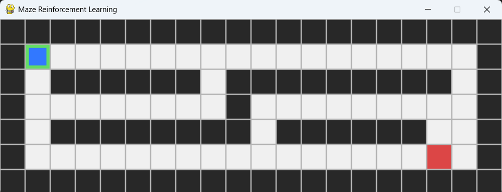
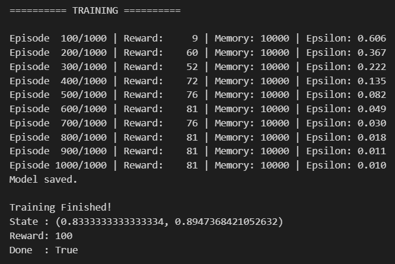
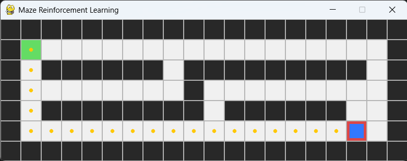
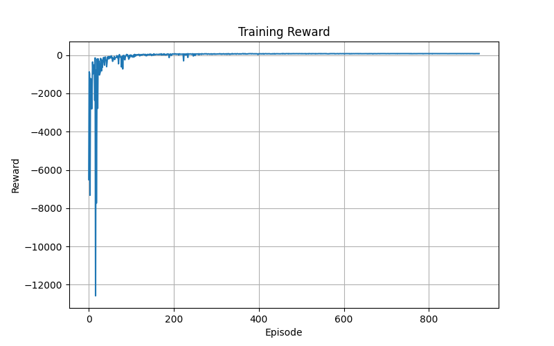

# Maze Solver using Deep Q-Network (DQN)

A reinforcement learning project that trains an autonomous agent to solve a maze using a **Deep Q-Network (DQN)** implemented **from scratch** with **PyTorch** and **Pygame**.

Unlike supervised learning, the agent is never given the correct path. Instead, it learns through trial-and-error by interacting with the environment, collecting experiences, and improving its policy over many episodes.

---

# Project Overview

This project was developed to understand the internal working principles of **Deep Reinforcement Learning**, rather than using existing RL libraries.

The implementation includes:

- Custom maze environment
- Deep Q-Network (DQN)
- Experience Replay
- Replay Buffer
- ε-Greedy Exploration
- Bellman Equation
- Neural Network Training
- Model Saving & Loading
- Autonomous Maze Solving

---

# Initial Maze

<p align="center">

</p>

The maze consists of four different cell types:

| Symbol | Meaning |
|--------|---------|
| **S** | Start Position |
| **G** | Goal |
| **.** | Free Cell |
| **#** | Wall |

---

# Reward Design

| Action | Reward |
|---------|--------|
| Move to empty cell | **-1** |
| Hit wall | **-5** |
| Reach goal | **+100** |

The reward function encourages the agent to:

- reach the goal,
- avoid walls,
- minimize unnecessary movements.

---

# State Representation

The neural network receives the agent's position as its input.

```python
State = (row, column)
````

Example:

```python
(1, 1)
```

Before entering the neural network, the coordinates are normalized between **0** and **1**.

---

# Action Space

The network predicts four possible actions.

```text
UP
DOWN
LEFT
RIGHT
```

Each output neuron represents the estimated **Q-value** for one action.

---

# Neural Network Architecture

```
Input (2)

↓

Linear (64)

↓

ReLU

↓

Linear (64)

↓

ReLU

↓

Linear (4)

↓

Q-values
```

Network Inputs

* Row Position
* Column Position

Network Outputs

* Q(UP)
* Q(DOWN)
* Q(LEFT)
* Q(RIGHT)

---

# Deep Q-Learning Workflow

During training the agent repeatedly performs the following cycle:

```
Reset Environment
        │
        ▼
Observe Current State
        │
        ▼
Forward Pass
        │
        ▼
Predict 4 Q-values
        │
        ▼
ε-Greedy Action Selection
        │
        ▼
Execute Action
        │
        ▼
Receive Reward
        │
        ▼
Observe Next State
        │
        ▼
Store Experience
        │
        ▼
Sample Replay Buffer
        │
        ▼
Bellman Update
        │
        ▼
Loss Calculation
        │
        ▼
Backpropagation
        │
        ▼
Update Network
```

---

# Experience Replay

Every interaction with the environment is stored as:

```python
(state,
 action,
 reward,
 next_state,
 done)
```

The replay buffer stores up to **10,000 experiences**.

Instead of learning only from the newest transition, the network randomly samples **32 experiences** during each training step.

This greatly improves learning stability by breaking the correlation between consecutive experiences.

---

# Bellman Equation

The target Q-value is calculated using

```
Target = Reward + γ × max(Q(next_state))
```

where

```
γ = 0.99
```

If the next state is the goal,

```
Target = Reward
```

This target is compared with the network prediction using **Mean Squared Error (MSE)**.

---

# Exploration vs Exploitation

The project uses an **ε-Greedy Policy**.

Initially,

```
ε = 1.0
```

meaning almost every action is random.

After every episode,

```
ε = ε × 0.995
```

until

```
ε = 0.01
```

The agent gradually shifts from exploration to exploitation as learning progresses.

---

# Training Configuration

| Parameter           | Value |
| ------------------- | ----: |
| Episodes            |  1000 |
| Batch Size          |    32 |
| Replay Buffer       | 10000 |
| Learning Rate       | 0.001 |
| Discount Factor (γ) |  0.99 |
| Initial ε           |   1.0 |
| Final ε             |  0.01 |

---

# Training Progress

The following screenshot shows the training progress together with the successful completion of training.

<p align="center">

</p>

Example output:

```
Episode 1000/1000 | Reward: 81 | Memory: 10000 | Epsilon: 0.010

Model saved.

Training Finished!
```

---

# Trained Agent

After training, press **D** to load the saved neural network and allow the agent to solve the maze autonomously.

<p align="center">

</p>

The trained agent successfully reaches the goal by following the learned policy.

---

# Episode vs Reward

The screenshot shows how the reward is improved gradually over the episodes.

<p align="center">

</p>

---

# Keyboard Controls

| Key     | Function                     |
| ------- | ---------------------------- |
| ↑ ↓ ← → | Manual movement              |
| **R**   | Random Action                |
| **A**   | Random Agent Episode         |
| **T**   | Train DQN                    |
| **D**   | Solve Maze using Trained DQN |

---

# Project Structure

```
Maze-DQN/
│
├── src/
   ├── agent.py
   ├── dqn.py
   ├── dqn_agent.py
   ├── environment.py
   ├── main.py
   ├── maze.py
   ├── replay_buffer.py
   ├── train.py
   └── maze_dqn.pth

```

---

# Running the Project

Set the repository like the above project structure

Install dependencies

Run the main.py file

---

# Concepts Learned

This project helped build a practical understanding of:

* Reinforcement Learning
* Markov Decision Process (MDP)
* States
* Actions
* Rewards
* Episodes
* Experience Replay
* Replay Buffer
* Mini-batch Learning
* Bellman Equation
* Deep Q-Network (DQN)
* Neural Networks
* Forward Propagation
* Backpropagation
* ε-Greedy Exploration
* Policy Inference

---

# Future Improvements

Possible future extensions include:

* REINFORCE (Policy Gradient)
* Actor-Critic
* PPO (Proximal Policy Optimization)
* Double DQN
* Dueling DQN
* Prioritized Experience Replay
* Random Maze Generation
* Dynamic Obstacles
* Curriculum Learning
* Performance Visualization
* TensorBoard Integration

---

# Technologies Used

* Python
* PyTorch
* Pygame

---

# License

This repository is intended for **educational and research purposes**.

---

## Acknowledgement

This project was implemented from scratch as part of a hands-on journey to understand **Deep Reinforcement Learning** by building every major component manually, including the environment, replay buffer, Deep Q-Network, training loop, and inference process.

```
```
